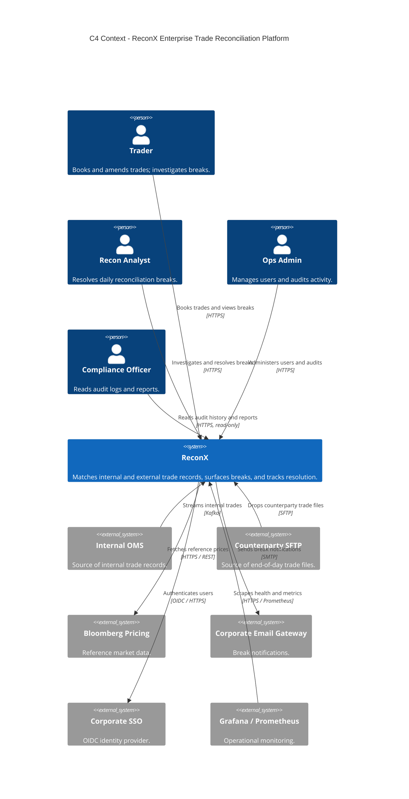

# ReconX Context Diagram

```mermaid
C4Context
    title C4 Context - ReconX Enterprise Trade Reconciliation Platform

    Person(trader, "Trader", "Books and amends trades; investigates breaks.")
    Person(analyst, "Recon Analyst", "Resolves daily reconciliation breaks.")
    Person(admin, "Ops Admin", "Manages users and audits activity.")
    Person(compliance, "Compliance Officer", "Reads audit logs and reports.")

    System(reconx, "ReconX", "Matches internal and external trade records, surfaces breaks, and tracks resolution.")

    System_Ext(oms, "Internal OMS", "Source of internal trade records.")
    System_Ext(sftp, "Counterparty SFTP", "Source of end-of-day trade files.")
    System_Ext(bloomberg, "Bloomberg Pricing", "Reference market data.")
    System_Ext(email, "Corporate Email Gateway", "Break notifications.")
    System_Ext(sso, "Corporate SSO", "OIDC identity provider.")
    System_Ext(grafana, "Grafana / Prometheus", "Operational monitoring.")

    Rel(trader, reconx, "Books trades and views breaks", "HTTPS")
    Rel(analyst, reconx, "Investigates and resolves breaks", "HTTPS")
    Rel(admin, reconx, "Administers users and audits", "HTTPS")
    Rel(compliance, reconx, "Reads audit history and reports", "HTTPS, read-only")
    Rel(oms, reconx, "Streams internal trades", "Kafka")
    Rel(sftp, reconx, "Drops counterparty trade files", "SFTP")
    Rel(reconx, bloomberg, "Fetches reference prices", "HTTPS / REST")
    Rel(reconx, email, "Sends break notifications", "SMTP")
    Rel(reconx, sso, "Authenticates users", "OIDC / HTTPS")
    Rel(grafana, reconx, "Scrapes health and metrics", "HTTPS / Prometheus")
```
